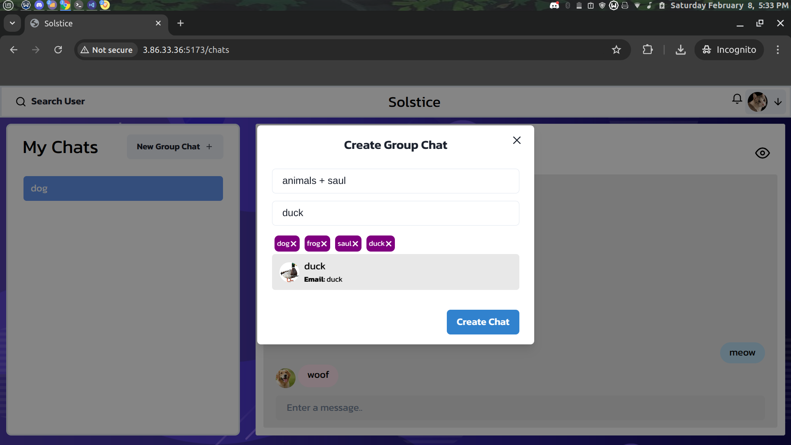

# Solstice - Real-Time Chat Application

**Solstice** is a real-time chat application built with the MERN stack (MongoDB, Express.js, React.js, Node.js) and Socket.io to enable real-time communication. It supports both one-on-one and group chats, real-time typing indicators, and the ability to manage group chats dynamically.

## Features

- **Real-Time One-on-One Chats**: Communicate with friends or colleagues in real-time with seamless private conversations.
- **Real-Time Group Chats**: Engage in group conversations where multiple users can interact simultaneously.
- **Typing Indicators**: Know when someone is typing in real-time.
- **Group Management**: Create, view, and manage groups. Add and remove users from groups dynamically.
- **User Search**: Easily search for users to start new conversations or join existing ones.

## Technologies Used

- **MongoDB**: NoSQL database used for storing user data and chat history.
- **Express.js**: Web framework for Node.js used for routing and handling HTTP requests.
- **React.js**: JavaScript library for building the front-end user interface.
- **Node.js**: JavaScript runtime environment for server-side logic.
- **Socket.io**: Enables real-time, bidirectional communication between the client and the server.

## Usage

- **Register/Log in**: Sign up or log in to the application to start chatting.
- **Start a One-on-One Chat**: Search for users and initiate private conversations.
- **Create a Group Chat**: Start a new group, add members, and begin chatting.
- **Manage Groups**: Add or remove users from existing groups.
- **Typing Indicator**: See when other users are typing in real time.

## Screenshots

Here are some screenshots of the application's user interface:

1. **Login Page**  
   

2. **Signup Page**  
   

3. **Search Users**  
   

4. **Create Group**  
   

5. **View Group**  
   

6. **Update Group**  
   

7. **View Profile**  
   

8. **One-on-One Chat**  
   

9. **Group Chat**  
   

10. **Real-Time Typing Indicator**  
    

## Contributing

We welcome contributions to improve the application! To contribute, please follow these steps:

1. Fork the repository.
2. Create a new branch for your feature or fix.
3. Commit your changes.
4. Push to your forked repository.
5. Open a pull request.

---

Feel free to reach out if you have any questions or suggestions!
